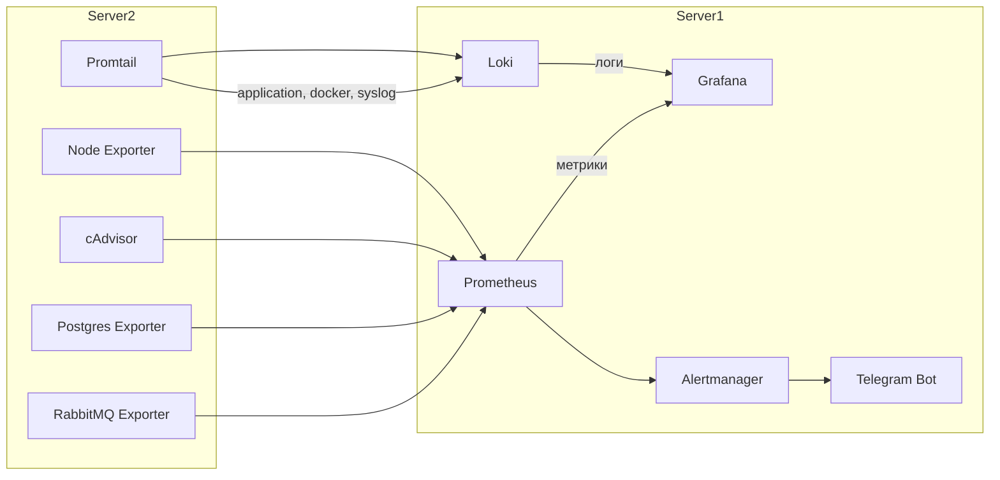

# Техническая документация по развертыванию и настройке системы мониторинга

## Архитектура решения

Система мониторинга состоит из двух серверов, каждый из которых использует отдельный репозиторий и собственный docker-compose файл.

### Сервер 1 `hackathon-monitoring`

- Контейнеры: Prometheus, Alertmanager, Grafana, Loki.
- Конфиг-файлы размещаются в корне проекта:
    - `docker-compose.yml`
    - `prometheus.yml`
    - `loki-config.yaml`
    - `alertmanager.yml`
    - `alerts.yml`
    - `grafana/datasources.yaml`
- Для сохранения данных используются Docker volume:
    - `grafanadata` — для дашбордов Grafana.
    - `prometheusdata` — для истории метрик Prometheus.
    - `alertmanager_data` — для истории Alertmanager.

### Сервер 2 `hackathon-export`

- Контейнеры: promtail, cadvisor, node-exporter, postgres-exporter, rabbitmq-exporter.
- Конфиг-файлы размещаются в каталоге проекта:
    - `docker-compose.yml`
    - `promtail-config.yaml`
- Приложения и экспортеры запускаются в отдельных контейнерах; promtail собирает логи из трех источников: application-логи, docker-логи, системные логи.

***

## Запуск инфраструктуры

### Сервер 1

Клонируется репозиторий, запуск `docker compose up -d` из каталога hackathon-monitoring.  
Expose-порты:
- Grafana — 3000
- Prometheus — 9090
- Loki — 3100
- Alertmanager — 9093

### Сервер 2

Клонируется второй репозиторий, запуск `docker compose up -d` из каталога hackathon-export.  
Expose-порты:
- promtail — 9080
- cadvisor — 8080
- node-exporter — 9100 (через host network)
- postgres-exporter — 9187
- rabbitmq-exporter — 9419

***

## Конфигурация компонентов

### Prometheus (сервер 1)

- Метрики собираются статически с сервера 2 по internal IP адресам и портам.
- Мониторинг осуществляется через экспортеры node, cadvisor, postgres, rabbitmq.
- Файл `prometheus.yml` включает правило alerts и интеграцию с Alertmanager по адресу `alertmanager:9093`.
- В директории проекта находится файл алертов `alerts.yml`.

### Grafana (сервер 1)

- Хранение дашбордов организовано через volume `grafanadata`.
- Источники данных: Prometheus (метрики), Loki (логи).
- Авторизация по умолчанию: admin/admin.

### Loki (сервер 1)

- Лог-файлы получаются от promtail по внутреннему IP.
- Хранение данных в томах, путь настроен через раздел `storage_config` в `loki-config.yaml`.

### Alertmanager (сервер 1)

- Конфигурация оповещений реализована через отдельный Telegram-бот.
- Файл алертов `alertmanager.yml` размещён и маунтится в контейнер Alertmanager.
- Алерты разделяются по приоритету и назначению (ресурсы, сервисы, экспортеры).

### Promtail (сервер 2)

- Сбор application-логов (`/app/logs/*.json`), docker-логов (через docker_sd_configs), системных логов (`/var/log/syslog`).
- Логи отправляются на Loki с помощью pipeline и структуры, определённой в `promtail-config.yaml`.

### Остальные экспортеры (сервер 2)

- Node Exporter, cAdvisor, Postgres Exporter, RabbitMQ Exporter запущены через docker-compose, участвуют в мониторинге метрик сервиса, оборудования и железа.

***

## Каналы оповещения

- Alertmanager интегрирован с Telegram через telegram_configs и отдельного бота.
- Для каждой группы алертов преднастроены отдельные шаблоны уведомлений.

***

## Алгоритм запуска и проверки

1. Клонирование соответствующего репозитория на каждый сервер.
2. Запуск сервисов командой `docker compose up -d` из корня проекта.
3. Проверка доступности интерфейсов по открытым портам.
4. Добавление собственных дашбордов в Grafana для метрик и логов.
5. Проверка алертов по событиям (создание test-alert или остановка экспортеров).
6. Контроль оповещений в Telegram в соответствии с заданными правилами.

***

## Примечания по эксплуатации

- Все настройки, созданные дашборды и история событий сохраняются в Docker volumes.
- Вся конфигурация (compose, alertrules, promtail) versioned в отдельных GitHub репозиториях для удобства обновления и воспроизводимости.
- Система покрывает мониторинг оборудования (node_exporter), мониторинг контейнеров (cadvisor), сервисов БД и брокера (postgres, rabbitmq), а также централизованный сбор и просмотр логов через Grafana и Loki.

***

## Примерная схема компонентов



***

## Файловая структура репозиториев

### hackathon-monitoring (сервер 1)
```
.
├── docker-compose.yml
├── prometheus.yml
├── loki-config.yaml
├── alertmanager.yml
├── alerts.yml
└── grafana/
    └── datasources.yaml
```

### hackathon-export (сервер 2)
```
.
├── docker-compose.yml
└── promtail-config.yaml
```

***

## Возможные проблемы и способы их проверки

- Проверка логов любого сервиса:
    ```
    docker logs <container_name>
    ```
- Если в Grafana "No data" — возможна ошибка datasource, отсутствует соединение с экспортером или сбой в promtail pipeline.
- Для проверки метрик можно обращаться к /metrics нужного сервиса curl'ом c первого сервера.

***

## Краткое резюме

В ходе хакатона реализована инфраструктура мониторинга микросервисов, включающая сбор метрик, централизованный логгинг, визуализацию данных и автоматические оповещения через Telegram. Все конфиги и история мониторинга versioned в репозиториях, развёртывание автоматизировано через Docker Compose и занимает несколько минут на каждом сервере.